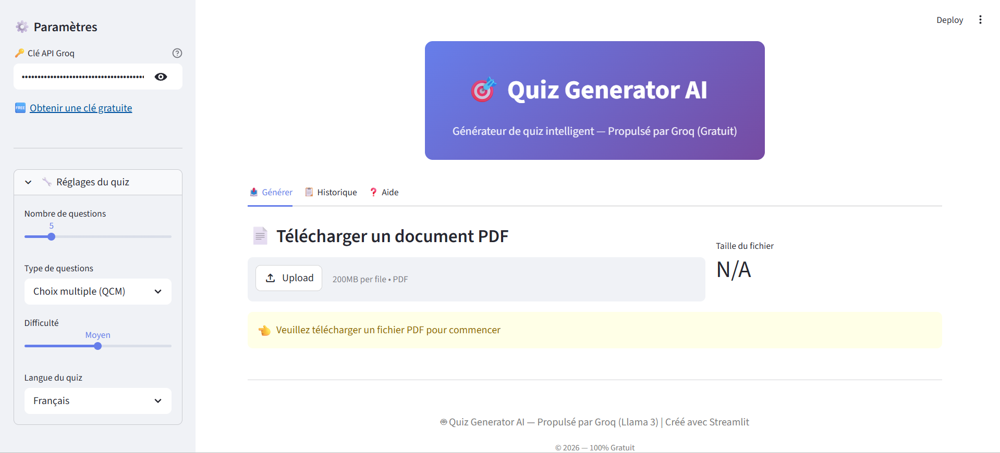
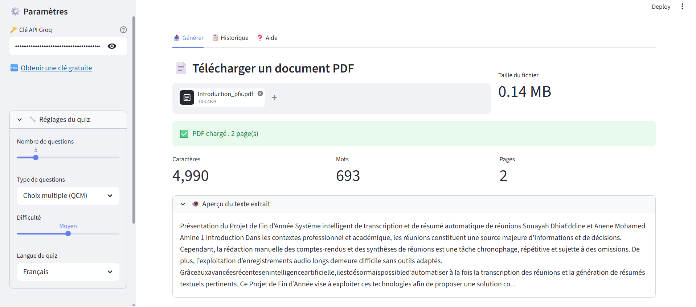
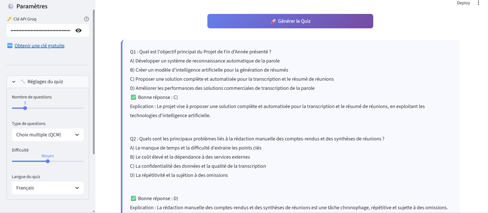
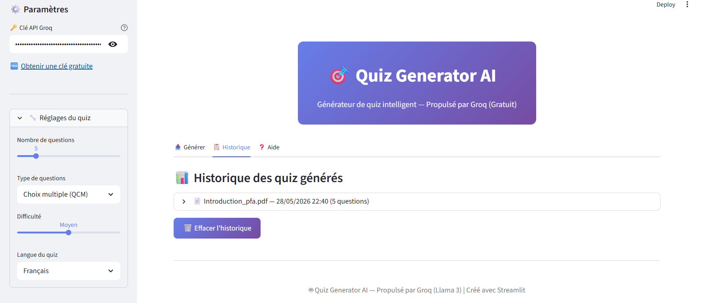
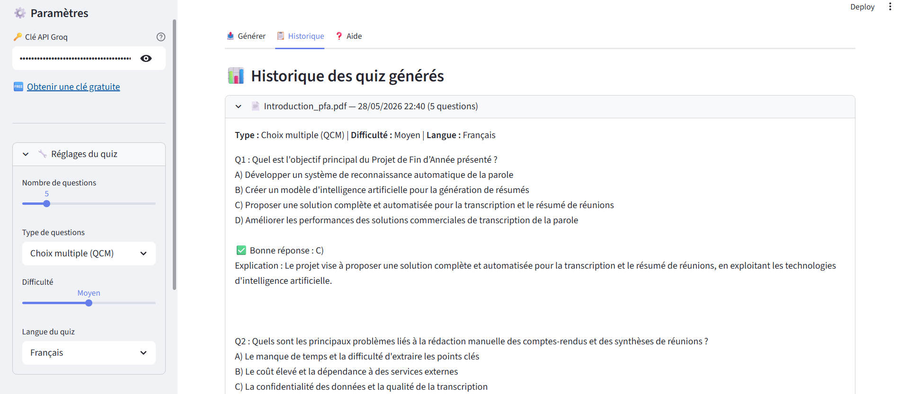

# 🎯 Quiz Generator AI

> Application web intelligente de génération automatique de quiz à partir de documents PDF, propulsée par **Llama 3.3 70B** via **Groq AI**.


---

##  Étudiant

| Nom complet | 
|---|
| Souayah Dhia Eddine |

**Établissement :** Ecole Nationale des Sciences et Technologies Avancées — Borj Cedria  
**Filière :** Systémes Industriels et Compétitivité : SIC  
**Année universitaire :** 2025-2026   

---

## 📋 Description

**Quiz Generator AI** est une application web qui permet de générer automatiquement des quiz pédagogiques et structurés à partir de n'importe quel document PDF. L'utilisateur uploade un cours, choisit le type de questions, la difficulté et la langue — et le modèle LLM génère instantanément un quiz complet avec réponses et explications.

---

## ✨ Fonctionnalités

- 📄 **Lecture PDF** — Extraction et nettoyage automatique du texte
- 🤖 **IA générative** — Génération via Llama 3.3 70B (architecture Transformer)
- 📝 **Types de questions** — QCM, Vrai/Faux, Réponse courte, Mixte
- 🌍 **Multilingue** — Français, Anglais, Arabe
- ⚙️ **Difficulté réglable** — Facile / Moyen / Difficile
- 📊 **Historique** — Sauvegarde des quiz générés pendant la session
- 💾 **Export** — Téléchargement en format TXT et JSON
- 🎨 **Interface moderne** — Design responsive avec Streamlit

---

## 🧠 Modèle IA utilisé

| Critère | Détail |
|---|---|
| **Modèle** | Llama 3.3 70B Versatile |
| **Type** | LLM (Large Language Model) |
| **Architecture** | Transformer |
| **Fournisseur** | Groq AI |
| **Accès** | API REST (gratuit) |

Le modèle **Llama 3.3 70B** est un Large Language Model open-source basé sur l'architecture **Transformer**, développé par Meta AI. Il analyse le contenu extrait du PDF et génère des questions pédagogiques pertinentes, structurées avec réponses et explications.

---

## 🖼️ Captures d'écran

### Interface principale


### PDF chargé et analysé


### Quiz généré avec succès


### Historique des quiz


### Historique des quiz


---

## 🎬 Démonstration vidéo

▶️ Vidéo de démonstration disponible sur demande.

---

## 🚀 Installation

### Prérequis
- Python 3.10+
- Une clé API Groq **gratuite** : [console.groq.com](https://console.groq.com)

### Étapes

**1. Cloner le dépôt**
```bash
git clone https://github.com/[votre-username]/QuizGeneratorAI.git
cd QuizGeneratorAI
```

**2. Créer un environnement virtuel**
```bash
python -m venv venv

# Windows
venv\Scripts\activate

# Linux / Mac
source venv/bin/activate
```

**3. Installer les dépendances**
```bash
pip install -r requirements.txt
```

**4. Lancer l'application**
```bash
streamlit run app.py
```

**5. Ouvrir dans le navigateur**
```
http://localhost:8501
```

---

## 📦 Dépendances

```txt
streamlit
PyPDF2
requests
```

---

## 🗂️ Structure du projet

```
QuizGeneratorAI/
│
├── app.py                  # Application principale Streamlit
├── requirements.txt        # Dépendances Python
├── README.md               # Documentation du projet
│
├── screenshots/            # Captures d'écran de l'application
│   ├── main.png
│   ├── pdf_loaded.png
│   ├── quiz_generated.png
│   └── history.png
│
└── demo/                   # Vidéo de démonstration
    └── demo.mp4
```

---

## 🔄 Pipeline de fonctionnement

```
📄 PDF uploadé par l'utilisateur
        ↓
🔍 Extraction du texte (PyPDF2)
        ↓
🧹 Nettoyage et normalisation du texte
        ↓
📡 Envoi à l'API Groq (Llama 3.3 70B)
        ↓
🤖 Génération du quiz par le LLM
        ↓
✅ Affichage + Export (TXT / JSON)
```

---

## 💻 Utilisation

1. Entrez votre **clé API Groq** dans la barre latérale
2. Réglez les paramètres : nombre de questions, type, difficulté, langue
3. Uploadez un **fichier PDF**
4. Cliquez sur **🚀 Générer le Quiz**
5. Consultez le quiz et téléchargez-le en TXT ou JSON

---

## 🌐 Technologies utilisées

| Technologie | Rôle |
|---|---|
| **Python** | Langage principal |
| **Streamlit** | Interface web |
| **PyPDF2** | Extraction de texte PDF |
| **Groq API** | Accès au modèle LLM |
| **Llama 3.3 70B** | Génération de quiz (Transformer) |
| **Requests** | Appels HTTP REST |

---

## 🔧 Dépannage

| Problème | Solution |
|---|---|
| Page blanche sur localhost | Lancer avec `streamlit run app.py` depuis le terminal |
| Clé API invalide | Vérifier la clé sur console.groq.com |
| Quota dépassé | Attendre quelques minutes ou créer une nouvelle clé |
| PDF sans texte | Utiliser un PDF texte (pas scanné/image) |
| Module introuvable | Relancer `pip install -r requirements.txt` dans le venv |

---

## 📝 Licence

Ce projet est réalisé dans le cadre d'un projet académique — ENSTAB 2025-2026.

---

## 📬 Contact

Pour toute question, contactez-nous via GitHub Issues.
